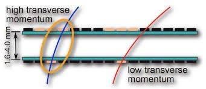
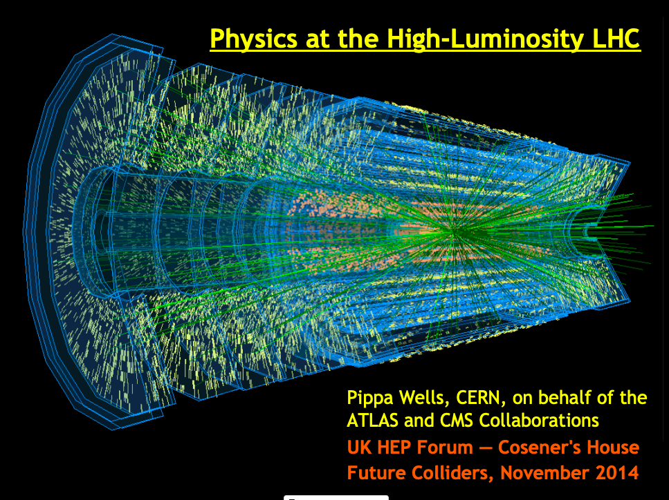
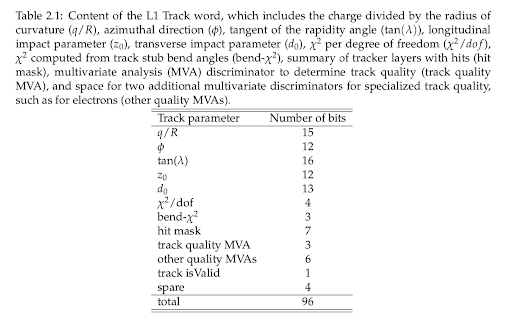

# CMS Track-Trigger ML
**Machine learning studies for the CMS track-trigger project.**

Info on the CMS track-trigger itself can be found in [this paper](https://arxiv.org/abs/1705.04321).
Info about the track-trigger algorithm can be found in [these slides](https://wiki.classe.cornell.edu/pub/People/AndersRyd/170629_Tracklet_AWLC.pdf).
Info on CMS as a whole can be found [here](https://home.cern/science/experiments/cms).
Below is a brief summary of how machine learning might be used in the track-trigger.

## A brief summary of this brief summary

The **track-trigger** takes in position-momentum pairs from the **tracker** and turns them into particle tracks.

For each track, the track-trigger sends a bit-wise **track word** to the **L1 trigger** to help it make its decisions on whether to keep events or not.

Because there are so many hits, the track-trigger can often fabricate tracks.

Various methods, including applying simple cuts to variables, are used to separate fake from real tracks. It is thought that machine learning could be a more performant way of doing this.

**By including the output of machine learning in the track word, we may be able to better inform the L1 trigger.**

## What's the track-trigger?

The track-trigger is an algorithm to be implemented for the [high luminosity LHC](https://home.cern/science/accelerators/high-luminosity-lhc), in 2026 or so.
Its goal is to give the most info about tracker tracks it can to the L1 trigger in a short amount of time.
Previously, the L1 trigger hadn't accepted information about tracks, and had only looked at info from ECAL, HCAL, and the muon system.

### Track-trigger input

The inputs to the track-trigger are stubs, position + pT (momentum in the transverse plane of the detector) measurements from an event which must have pT above 2 GeV.
We get pT measurements from the stubs by having a stub be composed of two hits, very close together.

As you know because you definitely read the papers pointed to at the top of this file, the solenoidal magnet in CMS curves the tracks of particles.
The longer a particle is exposed to the magnet, the more the track of the particle curves.
So, lower pT tracks will curve more.
The track-trigger only considers tracks with above 2 GeV because of the "search window" you can see above.
This restriction allows for greater computational efficiency when finding stubs.

### Track-trigger internals

To be as brief as possible, the track-trigger makes tracks out of these stubs.
The picture below shows a high-luminosity event in the future tracker.
The yellow hits are stubs, and the green lines are tracks.

What I'm trying to say is: *the track-trigger's job is hard*.
Because of how many stubs there are, the track-trigger can find tracks that aren't there, which goes against the stated goal of the track trigger.

These tracks have track parameters, like their transverse momemtum and their chi2 (a measure of how well the stubs fit with an idealized track), all of which depend upon the configuration of the stubs that make them up.

### Track-trigger output

THe outputs from the track-trigger are a 96-bit-long "word" for each track, where the bits are partitioned for information.

The section "other quality MVA's" (multivariate analysis; a category including both cut-based analysis and machine learning) has six bits reserved for it, which are what this repository was created for.

## How can machine learning help?

I mentioned that tracking is hard.
This is unfortunate, as the track-trigger wants to give as much good information to the L1 trigger as possible.
Now, the L1 has access to more information than the track-trigger does, such as information about particle type from the calorimeters.
The section above, "other quality MVAs", is partially for providing L1 with MVA information that it can cross-reference with info from the calorimeters and muon system.

This is a subtle concept (at least for me), so here's an example.

The first study that was done in this repository was on models trained only on primary electrons and fake tracks.
Let's say the L1 has received a track word that may correspond to an electron: electrons are often mistaken for fake tracks, so the track word section "track quality MVA" might give a low score.
However, if the L1 suspects the track of being an electron based off of ECAL information, it can look at the elctron score section of "other quality MVAs".

The reason that study was done was to see if using machine learning gave higher true positive and lower false positive rates than simply applying cuts when considering a newly introduced variable especially telling for identifying electrons.
Machine learning is great, but if we don't have to use it, we should keep things simple.

